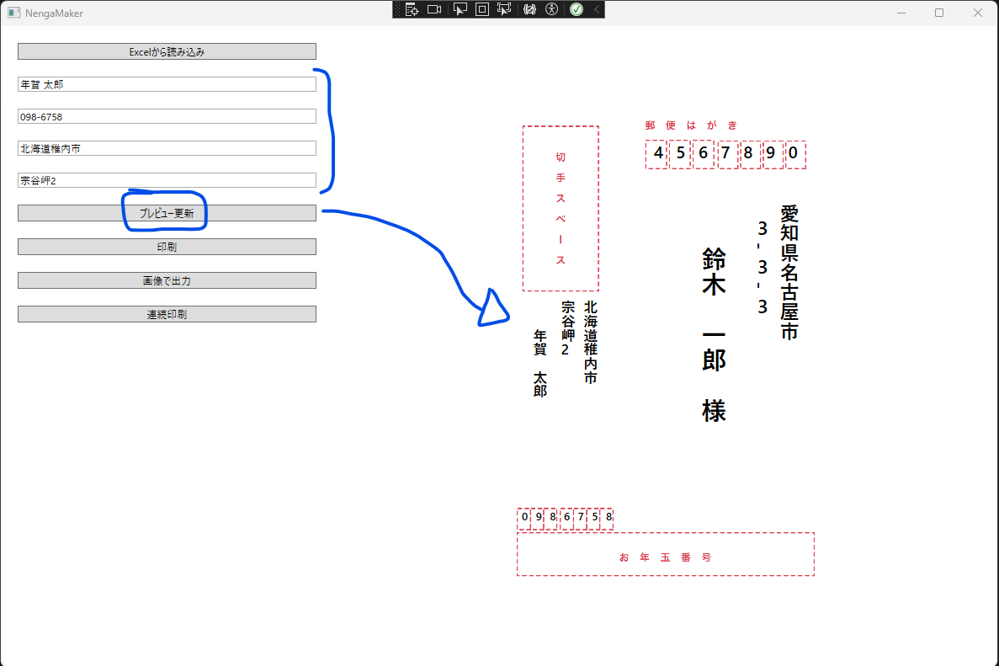
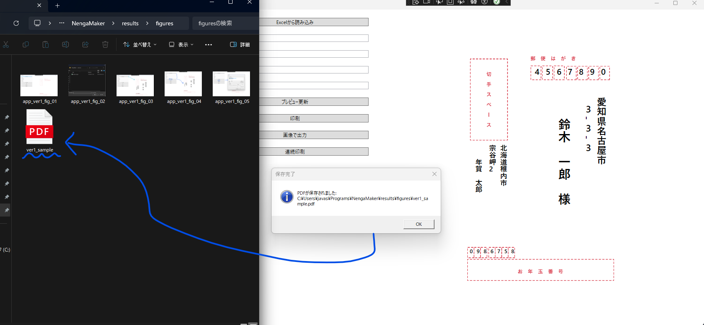

# Nenga Maker

en | [ja](./README_ja.md) 

The application for printing New Year's card addresses using an address book created in an Excel file.

## Execution Environment

---

- Windows 11 Pro 22H2 (22621.4037)
- Visual Studio 2022


## Setup

---

1. Download the Zip file containing the image templates from [this link](https://booth.pm/ja/items/2437125) and place it in the `postcard_resources` directory.
2. Execute the following command or convert the `psd` files to `png` files and place them in the `NengaMaker/figures` directory:
   ```bash
   cd postcard_resources
   python3 create_postcard_template.py
   ```
3. Open `NengaMaker.sln` in Visual Studio 2022.


## Execution

---

The application can be run from Visual Studio 2022 in either `Debug` or `Release` mode.


## App Examples

---


Excel Sample : [NengaMaker/resources/sample_nengajo.xlsx](./NengaMaker/resources/sample_nengajo.xlsx)







<br>

Output : [ver1_sample.pdf](./results/ver1_sample.pdf)


## Borrowed items

---

- https://booth.pm/ja/items/2437125