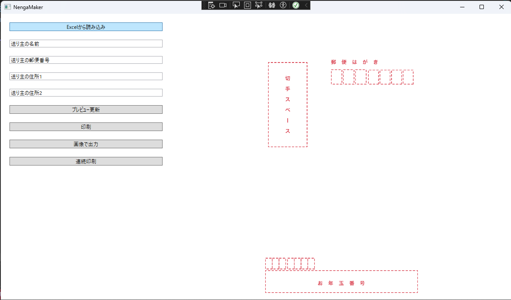
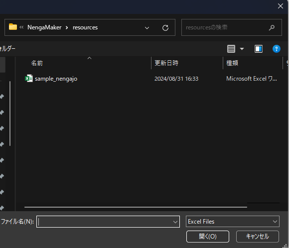
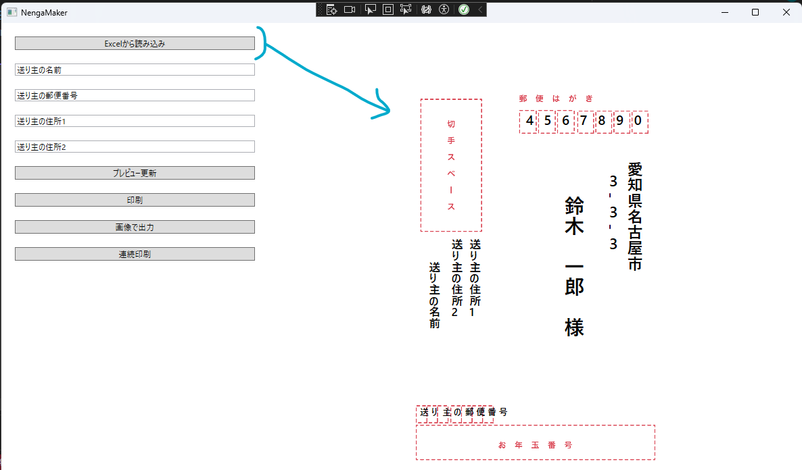
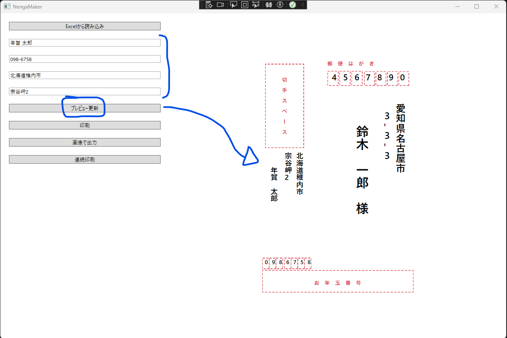
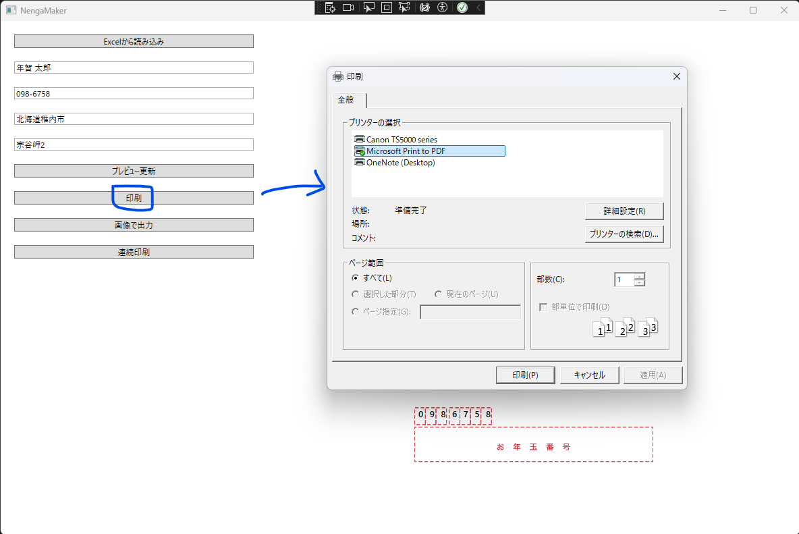
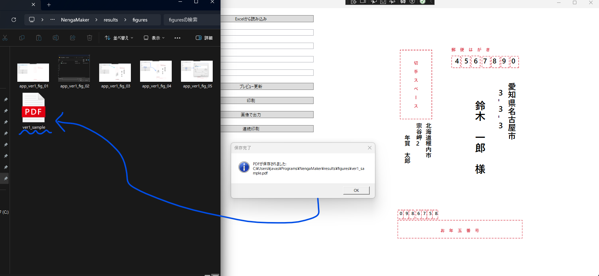

# Nenga Maker

[en](./README.md) | ja

エクセルファイルで作成された住所録を用いて年賀状の宛名を印刷するアプリ


## 実行環境

---

- Windows 11 Pro 22H2 (22621.4037)
- Visual Studio 2022


## セットアップ

---

1. https://booth.pm/ja/items/2437125 より画像テンプレートを含んだZipファイルをダウンロードし, `postcard_resources` に配置する
2. 以下を実行するか, `psd`ファイルを`png`ファイル変換し, `NengaMaker/figures`に配置する 
   ```bash
   cd postcard_resources
   python3 create_postcard_template.py
   ```
3. Visual Studio 2022で`NengaMaker.sln`を開く


## 実行

---

`Debug`, または`Release`でVisual Studio 2022から実行可能


## アプリの使用例

---



Excel Sample : [NengaMaker/resources/sample_nengajo.xlsx](./NengaMaker/resources/sample_nengajo.xlsx)










<br>

出力結果 : [ver1_sample.pdf](./results/ver1_sample.pdf)


## お借りしたもの

---

- https://booth.pm/ja/items/2437125